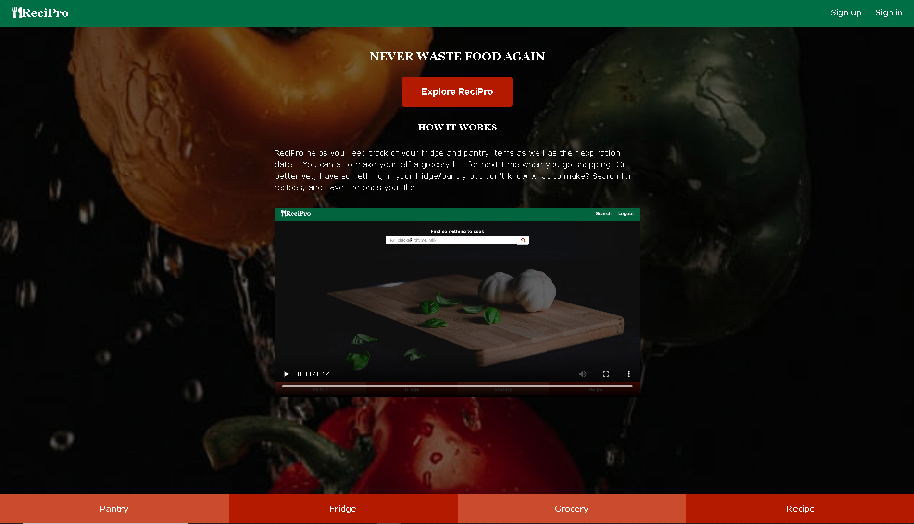

# ReciPro 

**link to app:** 
https://recipro-app.now.sh/

**API Documentation:** 
https://github.com/ewang10/recipro-api

**Description:**
ReciPro allow users to keep track of their pantry and fridge items as well as the items' expiration date. The app also allow users to create their own grocery list, search for recipes and save them to use it in the future. In order to use the functionality of the app, users need to register for an account and login.

**Techonologies used:**
HTML/CSS/JavaScript/Node/Express/React/JSX/Knex/PostgreSQL
